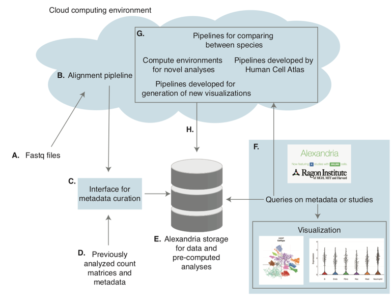

# The Alexandria Project
A Single-Cell RNA-Seq and Analytics Platform for Global Health
  

[Here](https://alexandria-scrna-data-library.readthedocs.io/en/latest/) is a linke to the work-in-progress documentation for the [Alexandria platform](https://singlecell.broadinstitute.org/single_cell?scpbr=the-alexandria-project) and all associated tool workflows and notebooks.

### Background

Alexandria is a single-cell portal and data resource for the global health community.
Alexandria will use unified pipelines to preprocess, store, and visualize datasets of interest to the global health community, enabling rapid realization of transformative insights and the prioritization of follow-ups. To maximize impact and utility, Alexandria will build upon existing efforts at the Broad, Single Cell Portal, but will be further enhanced to enable queries across gene sets, cell types, and models as inspired by the types of data collected by the global health community. This will power vital cross-comparisons while simultaneously providing novel analytic capabilities for the community at large. Moreover, Alexandra will similarly empower the broader global research community—from individuals with limited experience in single-cell analysis to power users looking to more rapidly isolate specific subsets of data from several experiments—to examine and parse scRNA-Seq data, so that the insights and intuitions of the entire scientific community can be leveraged to enable rapid progress in fighting a variety of human maladies.

### Why use Alexandria?
There are a variety of features that Alexandria plans to provide users 
- The ability to cross project query on the cell level
- Easy communication with collaborators: studies may be kept private during active analysis and shared only with desired groups.
- Access to a variety of analysis pipelines and environments