# Running dropseq_cumulus on Alexandria

The Alexandria portal is hosted on the Broad Institute's Single Cell Portal (SCP), therefore running the workflow here is identical to running it on SCP.
  
The Alexandria workflow version of dropseq_cumulus is intended as a user-accessible means of analyzing and visualizing single-cell RNA-seq data. Therefore, only essential parameters are exposed.  
  
Those who would like more options for running the workflow should [use the Terra version](https://alexandria-scrna-data-library.readthedocs.io/en/latest/terra/) of the workflow and then transfer/sync the outputs to your Alexandria workspace study bucket.  
  
If you truly would like certain parameters to be exposed, please contact jgatter@broadinstitute.org.

### KNOWN BUGS

None known at this time, please contact us with bug reports on our GitHub repo.

### 1. Sign In
Visit the [Alexandria site](https://singlecell.broadinstitute.org/single_cell?scpbr=the-alexandria-project) and at the top-right click "Sign In". Sign in using your broadinstitute.org email account and allow permissions. 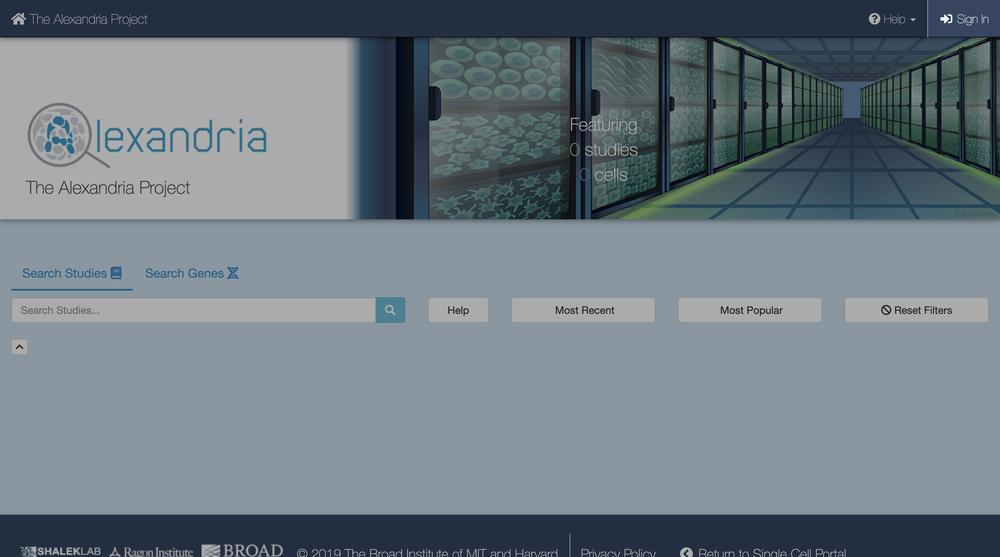
  
### 2. Create a New Study
To create a new study, click Add a Study. Alternatively, to run the workflow on a pre-existing study, select "My Studies", click the Upload/Edit Study button for your study of choice and proceed to [upload your sequence data files](https://alexandria-scrna-data-library.readthedocs.io/en/latest/alexandria/#3-uploading-sequence-data-files). 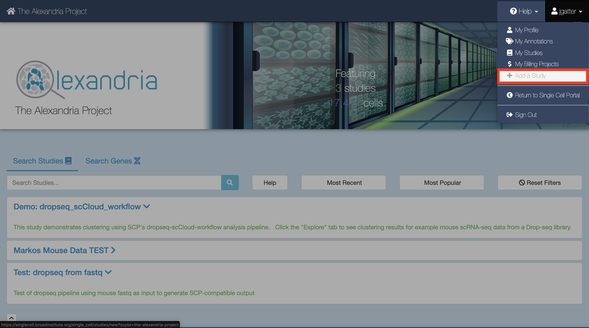
When you arrive at the New Study page, first enter the name that you and others will use to identify your study.  
  
Then, use the FireCloud Billing Project dropdown menu to select a billing project other than Default Project in order to run workflows in your study. If you do not have a billing project associated with your account, first click the "create a billing project" hyperlink under the Billing Projects header, on the next page click New Billing Project, and then follow the instructions supplied by clicking the ["Instructions on creating Google billing accounts"](https://software.broadinstitute.org/firecloud/documentation/article?id=9762) button. You must include a billing project to access pipelines.  
  
Next, fill out other fields to your liking, including the "No Data Download Until?" box, the "Public" dropdown menu, the "Use an existing workspace?" dropdown menu, and the "Description" box. 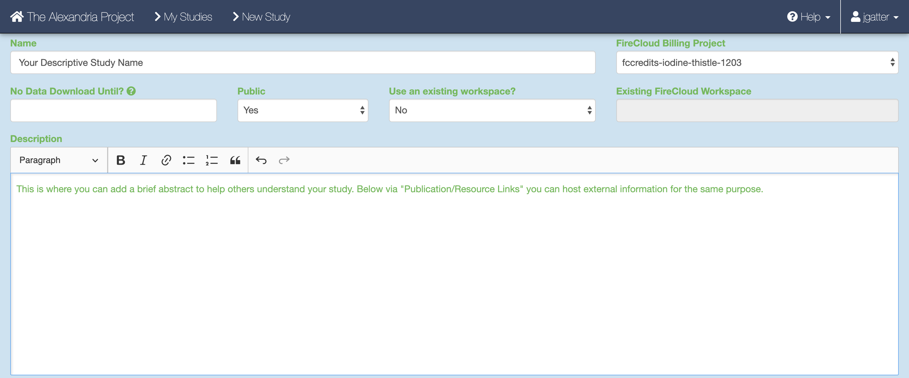. 
To share your study with others, click the "Share Study" button for whomever you wish to share your study with and then enter in their respective emails and permissions.  
  
Attach external resources or publications that will help viewers understand your study using the "Add an External Resource" button for however documents you wish to share.  
When all fields are filled in to your satisfaction, click the "Create Study" at the bottom. 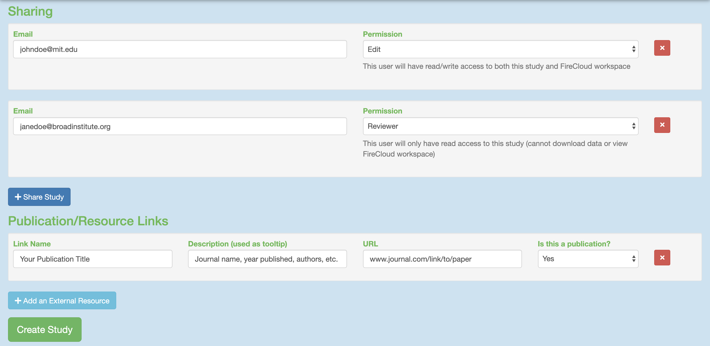
  
### 3. Uploading Sequence Data Files
When the study is created you will arrive at the Upload/Edit Study page. Since we are running the workflow and do not have any expression matrix, metadata, cluster, or coordinate label files yet (these will be produced by the workflow), click the "Sequence Data" tab. 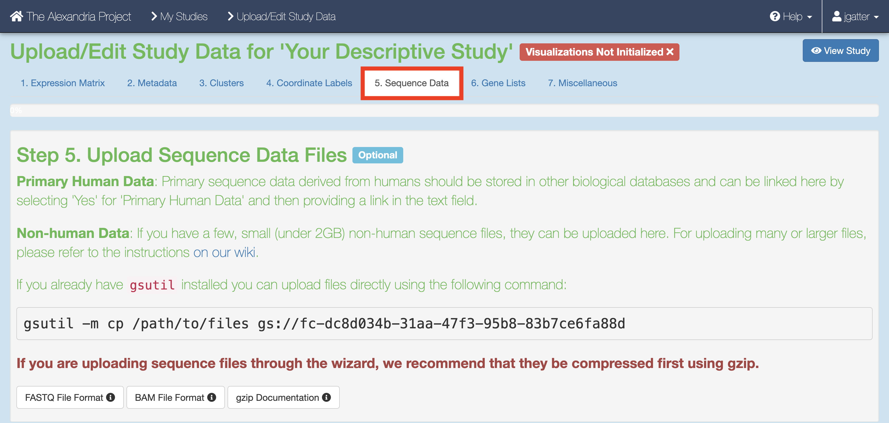
  
There are a few methods of uploading files to your workspace Google Bucket. Before proceeding, find your workspace bucket by visiting your workspace's "Dashboard" tab. In the bottom-right corner of the dashboard, you will see your Google Bucket ID which you can copy by clicking the adjacent clipboard button. You can visit the bucket interface by clicking the "Open in Browser" hyperlink.
 
First upload your sequence data files. We highly recommend installing and using `gsutil`, a fast and powerful tool made by Google that quickly moves files to and from the cloud. Through your computer's console, install the `gsutil` tool by following the [installation guide](https://cloud.google.com/storage/docs/gsutil_install). An example command that would transfer files from your computer to the workspace bucket would be:  
`gsutil -m cp local/path/to/file.fastq.gz gs://[Bucket ID]/destination/directory/`  
For an entire folder of sequence data, copy it recursively through using the command as such:  
`gsutil -m cp -r local/path/to/folder gs://[Bucket ID]/destination/directory`.   
Any desination path that does not exist already will be created upon entering the command!  

### 4. Uploading Your Input CSV File
When you have finished uploading your sequencing data, proceed to the "Miscellaneous" tab. Here is where you will upload your input_CSV_file (spreadsheet) that will instruct the workflow. 
  
Write your input csv file in a text editor or a spreadsheet manipulation program such as Microsoft Excel and save your file as a comma-separated value (.csv) file. The input CSV file must have column headers and contains the following in whatever order:

* **(REQUIRED)** the 'Sample' column, the sample/array names that prefix the respective .fastq(.gz) files/BCL directories and the count matrices outputted by Drop-seq pipeline.

* (OPTIONAL) both 'R1_Path' and 'R2_Path' columns, the paths to .fastq(.gz) files on the bucket. If these columns are not included or if some spreadsheet cells under these columns are left blank, the workflow will check `dropseq_default_directory` by default for unspecified files searching for the pattern `<Sample Name>*<R1 or R2>*.fastq.gz`. As an example, for `gs://bucketID/fastqs/samplename_R1.fastq` you could enter "gs://bucketID/fastqs/samplename_R1.fastq", "fastqs/samplename_R1.fastq", or leave it blank and enter "fastqs" for the `dropseq_default_directory`.

* (OPTIONAL) 'BCL_Path' column, the paths to the BCL directories on the bucket. If not included or if cells are left blank, will check dropseq_default_directory by default. Include this column only if `run_bcl2fastq=true`. R1_Path and R2_Path columns will be ignored if so.

* (OPTIONAL) Other metadata columns that will be appended to the alexandria_metadata.txt (tab-delimited) file generated after running Cumulus. Column labels MUST match EXACTLY the names of the ATTRIBUTE list in the [Alexandria Metadata Convention](https://alexandria-scrna-data-library.readthedocs.io/en/latest/metadata/#the-alexandria-metadata-convention). Labels outside of this convention will be supported in the future. 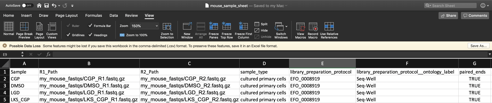

To verify that the paths you listed in the file are correct, you can navigate to your bucket using the instructions listed [above](https://alexandria-scrna-data-library.readthedocs.io/en/latest/alexandria/#3-add-your-sequence-data-and-input-csv-file) and locate your sequence data files. Click on each file to view its URI (gsURL), which should resemble the format `gs://<bucket ID>/path/to/file.fastq.gz` in the case of `gzip`-compressed FASTQ files (regular FASTQ files are fine too). The locations you should enter in the path columns of your input CSV file should be all of the characters following the bucket ID and trailing slash, in this case `path/to/file.fastq.gz`. 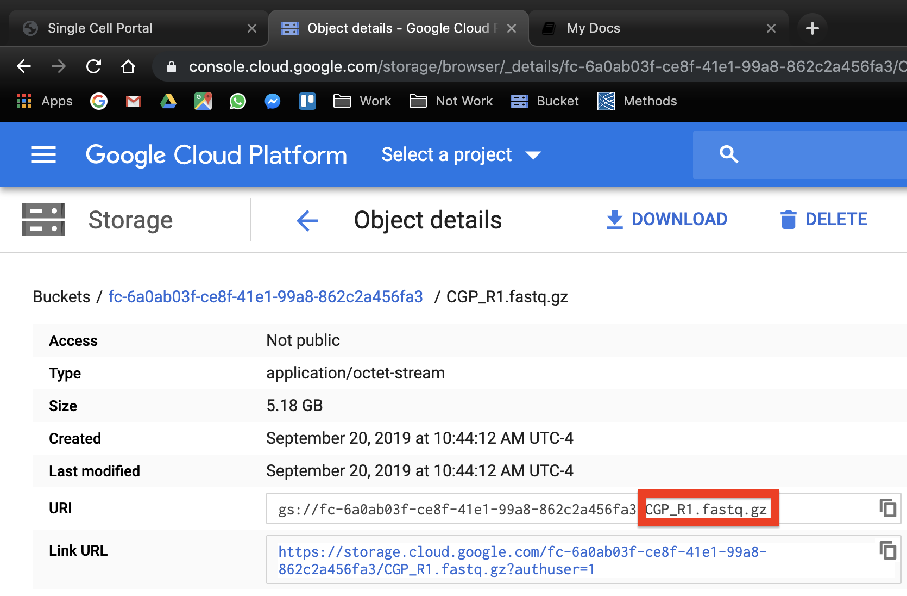
  
To upload the input CSV file, click the "Choose File" button and navigate to select your input CSV file. Then set the file type as "Other" and click "Save" under the "Actions" text. 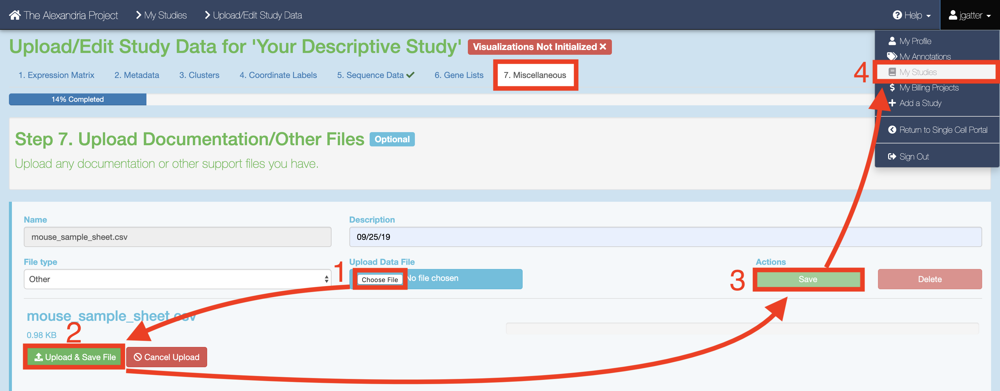
  
### 5. Configure and Launch dropseq_cumulus
**To ensure that your study recognizes all files, return to your "My Studies" page and hit the "Synchronize" button for your study.**
  
On the "My Studies" page, click the name of your study hyperlink. Next, visit the "Analysis" tab which contains your "Submission History" and the interface that allows you to "Submit a Workflow."  

By default you are on the "Select Workflow" tab. Use the dropdown menu to select the dropseq_cumulus workflow. 
Then, click on the "Configure Inputs & Submit" tab. Read the table of parameters below and enter the fields for each parameter to your liking. 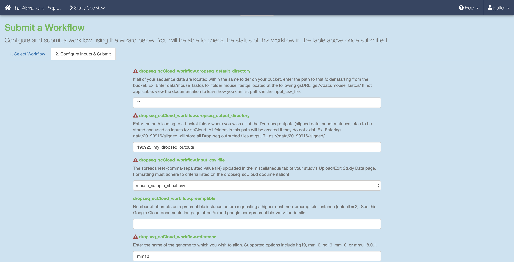

Once done, click the "Submit Workflow" button at the bottom to submit the dropseq_cumulus job. Your job is viewable up top underneath the "Submission History" header. 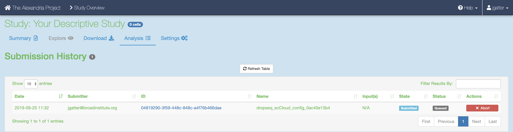

Here you will eventually know if the job ran succesfully. Provided the job does not fail within 10 minutes, the job will take about a variable amount of time to complete depending on the tasks you are running and the amount of data you gave it. Drop-seq pipeline usually will take 20 to 45 hours to run while Cumulus should take an hour or less.

### 6. Advice for Troubleshooting on Alexandria/SCP
If the job fails it is recommended you navigate to and read the log file of the task that failed.  
To do this, click the Link URL of the failed job. 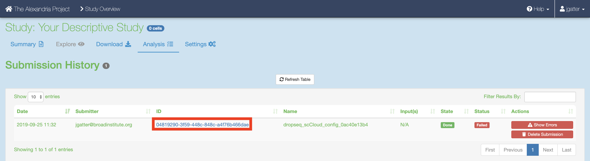
  
Navigate to the log file of the failed task, which in this case is setup_dropseq. 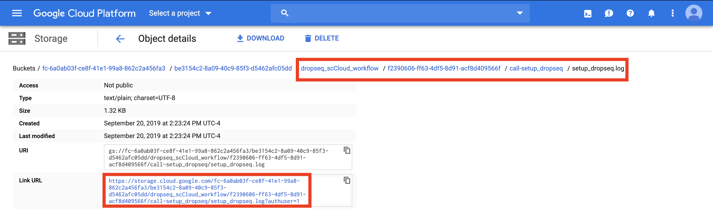

Evaluate the error based on the message and decide whether you need to alter variables, move files in your bucket, or change and reupload your input CSV file. 

**Make sure to synchronize your study before relaunching the job.**

### 7. Synchronizing and Exploring Visualization Options
If you study ran through the Cumulus task successfully: 
Synchronize your the outputs by clicking the "Sync" button in the "Analysis" tab. 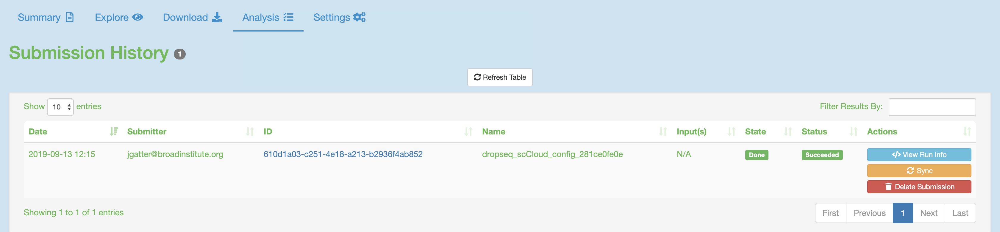
Visualize the study by clicking the "Explore" tab and then the "View Options" hyperlink to gain more options for analysis. 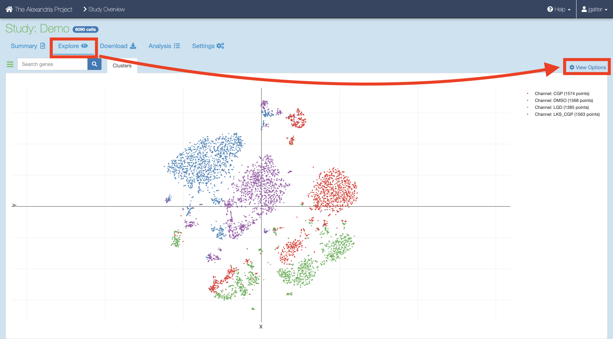