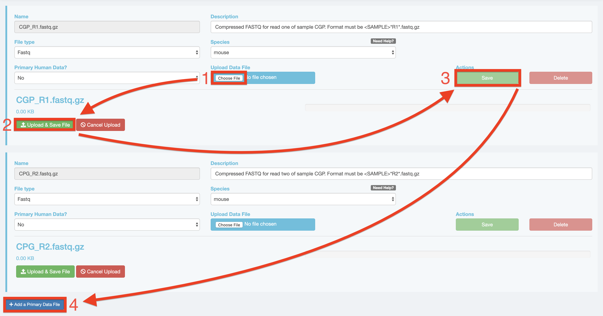
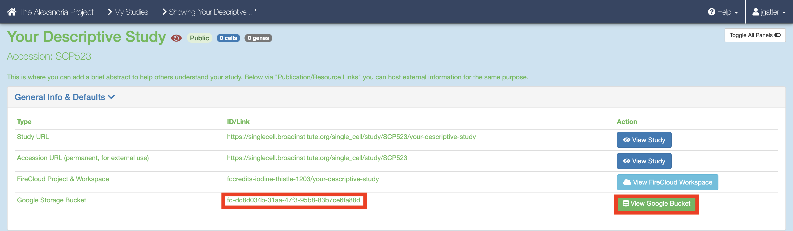

# Running dropseq_scCloud on Alexandria

The Alexandria portal is hosted on the Broad Institute's Single Cell Portal (SCP), therefore running the workflow here is identical to running it on SCP.
  
The Alexandria workflow version of dropseq_scCloud is intended as a user-accessible means of analyzing and visualizing single-cell RNA data. Therefore, only essential parameters are exposed.  
  
Those who would like more options for running the workflow should [use the Terra version](/terra/) of the workflow and then transfer/sync the outputs to your Alexandria workspace study bucket.  
  
If you truly would like certain parameters to be exposed, please contact jgatter@broadinstitute.org.

### KNOWN BUGS IN v7:

* Do not upload sequence files into the root of the bucket, instead use `gsutil` to move them into a folder on your bucket. Example: `gsutil -m cp -r local/mouse_fastqs gs://[bucket ID]/mouse_fastqs`. `gsutil -m mv gs://[bucket ID]/*.fastq.gz gs://[bucket ID]/mouse_fastqs` can be used to move all FASTQs already on the bucket to a directory mouse_fastqs that will be automatically created.

* `is_bcl=true`/`run_bcl2fastq=true` is broken due to regevlab changing their docker repo for the tool.

### 1. Sign In
Visit the [Alexandria](https://singlecell.broadinstitute.org/single_cell?scpbr=the-alexandria-project) and at the top-right click "Sign In". Sign in using your broadinstitute.org email account and allow permissions. 
  
### 2. Create a New Study
To create a new study, click Add a Study. Alternatively, to run the workflow on a pre-existing study, select "My Studies", click the Upload/Edit Study button for your study of choice and proceed to [upload your sequence data files](#3-uploading-sequence-data-files). 
When you arrive at the New Study page, first enter the name that you and others will use to identify your study.  
  
Then, use the FireCloud Billing Project dropdown menu to select a billing project other than Default Project in order to run workflows in your study. If you do not have a billing project associated with your account, first click the "create a billing project" hyperlink under the Billing Projects header, on the next page click New Billing Project, and then follow the instructions supplied by clicking the ["Instructions on creating Google billing accounts"](https://software.broadinstitute.org/firecloud/documentation/article?id=9762) button.  
  
Next, fill out other fields to your liking, including the "No Data Download Until?" box, the "Public" dropdown menu, the "Use an existing workspace?" dropdown menu, and the "Description" box. . 
To share your study with others, click the "Share Study" button for however people as you wish to share your study with and then enter in their respective emails and permissions.  
  
Attach external resources or publications that will help viewers understand your study using the "Add an External Resource" button for however documents you wish to share.  
When all fields are filled in to your satisfaction, click the "Create Study" at the bottom. 
  
### 3. Uploading Sequence Data Files
When the study is created you will arrive at the Upload/Edit Study page. Since we are running the workflow and do not have any expression matrix, metadata, cluster, or coordinate label files yet, click the "Sequence Data" tab. There are three methods of uploading sequence data:  

1. `gsutil` **HIGHLY RECOMMENDED FOR ALL CASES:** If you have human data, data that is not a FASTQ, BAM, or gzip, or data that is larger than 2GB, you will need to use Google Cloud's [gsutil tool](https://cloud.google.com/storage/docs/gsutil) through your computer's console. You can follow Single Cell Portal's instructions on [how to upload files via gsutil](https://github.com/broadinstitute/single_cell_portal/wiki/Uploading-Files-Using-Gsutil-Tool). It's super fast and not too hard to get the hang of! 
2. If you are looking for something simpler and have non-human FASTQ, BAM, or gzip files that under 2GB, look at the blue fields below. You can upload a file by clicking the "Upload Data File" button and navigating to the file of interest. Once done, enter the name, description, File type, species, whether the data is human or not, and then click "Upload & Save File" and "Save". To add more files that match this criteria, click "Add a Primary Data File" and repeat the process. 
3. A third option is visiting the study's Google Bucket and manually uploading files, but note that this takes a considerable amount of time! Return to "My Studies" through the top-right dropdown menu that has your account name and select the "Show Details" button for your study. On the the details page, scroll down and click the "View Google Bucket" button that is next to the Google Storage Bucket ID.  This button brings you to the Google Cloud Bucket associated with you study which is where all study files are uploaded. Click the "Upload Files" button and navigate to and select your sequence data files and hit the "Open" button. Return to your "My Studies" page and hit the "Upload/Edit Data" button for your study to upload the input CSV file in step 5. . 

### 4. Uploading Your Input CSV File
When you have finished uploading your sequencing data, proceed to the "Miscellaneous" tab. Here is where you will upload your input_CSV_file (spreadsheet) that will instruct the workflow. **The writing of your input CSV file must adhere to the criteria listed in the [Basic Usage](#basic-usage) section.**  
  
Optional: If you need to verify that your paths listed in the R1_Path and R2_Path columns or the BCL_Path column are correct, visit your bucket by following the steps in the third option of step 4. Find your sequence data files and click on them to view their URI (gsURL), which should resemble the format `gs://<bucket ID>/path/to/file`. The locations you should enter in your input CSV file should be all characters following the bucket ID and trailing slash, in this case `path/to/file`. Then return to the "Miscellaneous Tab" of the "Upload/Edit Data" page. 
  
To upload the input CSV file, click the "Choose File" button and navigate to select your input CSV file. Then set the file type as "Other" and click "Save" under the "Actions" text. 
  
### 5. Configure and Launch dropseq_scCloud
**To ensure that your study recognizes all files, return to your "My Studies" page and hit the "Synchronize" button for your study.**
  
On the "My Studies" page, click the name of your study hyperlink. Next, visit the "Analysis" tab which contains your "Submission History" and the interface that allows you to "Submit a Workflow."  

By default you are on the "Select Workflow" tab. Use the dropdown menu to select the dropseq_scCloud workflow. 
Then, click on the "Configure Inputs & Submit" tab. Read the table of parameters below and enter the fields for each parameter to your liking. 

Once done, click the "Submit Workflow" button at the bottom to submit the dropseq_scCloud job. Your job is viewable up top underneath the "Submission History" header. 

Here you will eventually know if the job ran succesfully. Provided the job does not fail within 10 minutes, the job will take about a variable amount of time to complete depending on the tasks you are running and the amount of data you gave it. Drop-seq pipeline usually will take 20 to 45 hours to run while scCloud should take an hour or less.

### 6. Advice for Troubleshooting on Alexandria/SCP
If the job fails it is recommended you navigate to and read the log file of the task that failed.  
To do this, click the Link URL of the failed job. 
  
Navigate to the log file of the failed task, which in this case is setup_dropseq. 

Evaluate the error based on the message and decide whether you need to alter variables, move files in your bucket, or change and reupload your input CSV file. 

**Make sure to synchronize your study before relaunching the job.**

### 7. Synchronizing and Exploring Visualization Options
If you study ran through the scCloud task successfully: 
Synchronize your the outputs by clicking the "Sync" button in the "Analysis" tab. 
Visualize the study by clicking the "Explore" tab and then the "View Options" hyperlink to gain more options for analysis. 