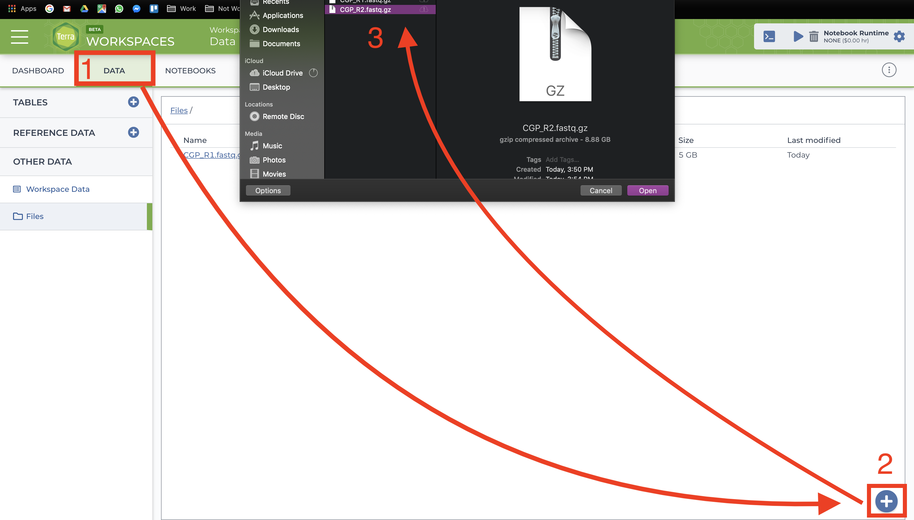
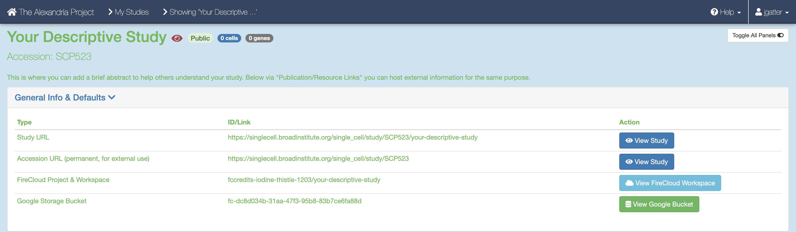
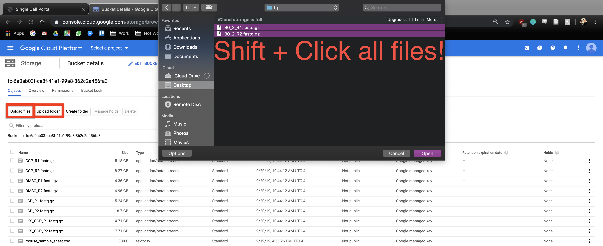
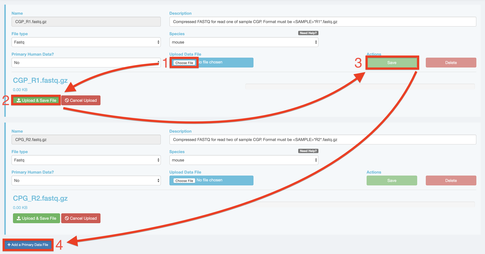

# Alternatives to uploading data
  
We highly recommend installing and using `gsutil` for method upload, but with that being said, there are other methods of data upload.
## Terra
### Google Bucket interface
  
You can also manually upload data to the Google Bucket, but note that this process take much more time than `gsutil`. At the bottom right of your workspace's "Dashboard" tab, click the "Open in Browser" hyperlink to visit your bucket. Click either the "Upload File" or "Upload Folder" button to navigate to and upload your files or a folder containing your files respectively. 
  
### Terra Data tab

Alternatively to `gsutil` and Google Bucket file uploading, users can manually upload data one file at a time through the Terra interface. This method is painfully slow so you should only use this for small files like sample sheets. Go to the "Data" tab and click the plus button towards the bottom-right of the page. Navigate to and select your file and hit open. Repeat the process for however many files. 

## Alexandria 
### Google Bucket interface
Another option is visiting the study's Google Bucket and manually uploading files, but note that this takes a considerable amount of time! Return to "My Studies" through the top-right dropdown menu that has your account name and select the "Show Details" button for your study. On the the details page, scroll down and click the "View Google Bucket" button that is next to the Google Storage Bucket ID.  This button brings you to the Google Cloud Bucket associated with you study which is where all study files are uploaded. Click either the "Upload File" or "Upload Folder" button to navigate to and upload your files or a folder containing your files respectively. Return to your "My Studies" page and hit the "Upload/Edit Data" button for your study to upload the input CSV. . 

### Upload & Save File button
If you are looking for something simpler and have non-human FASTQ, BAM, or gzip files that under 2GB, look at the blue fields below. You can upload a file by clicking the "Upload Data File" button and navigating to the file of interest. Once done, enter the name, description, File type, species, whether the data is human or not, and then click "Upload & Save File" and "Save". To add more files that match this criteria, click "Add a Primary Data File" and repeat the process. 