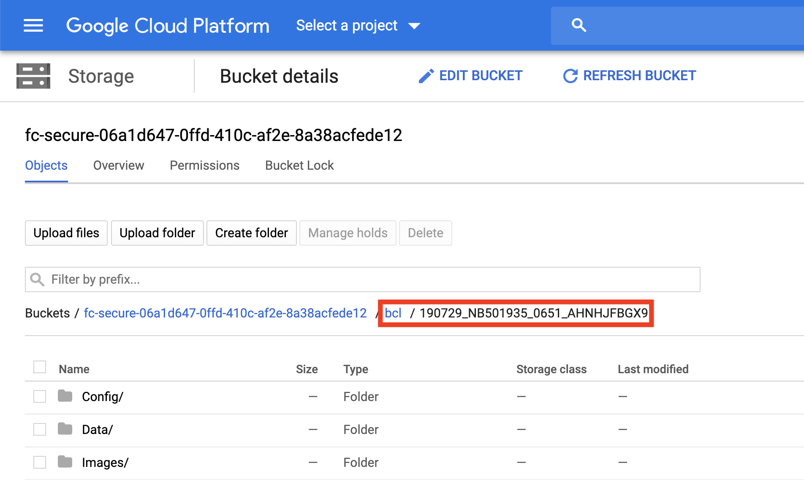
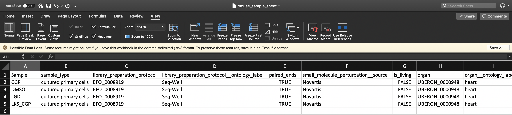
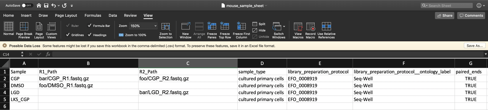

# Inputs/Outputs

## The Alexandria Sheet

To instruct the workflow, you must create a comma-separated-value (csv) sample sheet called the Alexandria Sheet which contains sample names, paths to sequencing data on the workspace bucket, and any metadata you wish to include on Alexandria.

### Formatting your Alexandria Sheet for FASTQ files

For processing a sequencing directory full of BCL files, see the below section instead.

Write your Alexandria Sheet in a text editor or a spreadsheet manipulation program such as Microsoft Excel and save your file as a comma-separated value (.csv) file. The Alexandria Sheet must have column headers and contains the following in whatever order:

```eval_rst
.. Important::
  - **(REQUIRED)** the 'Sample' column; the sample/array names that must prefix the respective .fastq or .fastq.gz files. Any preexisting count matrices must be named as ``<sample>_dge.txt.gz`` and located in the bucket at ``<output_path>/dropseq/<sample>/<sample>_dge.txt.gz``.
  - (RECOMMENDED) both 'R1_Path' and 'R2_Path' columns; the paths to .fastq/.fastq.gz files on the bucket. Alternatively, see the `section on the fastq_directory parameter <dropseq_cumulus.html#understanding-the-fastq-directory-parameter>`_. 
  - (OPTIONAL) Other metadata columns that will be appended to the alexandria_metadata.txt (tab-delimited) file generated after running Cumulus. Column headers *must match exactly* the names of attributes found in the `Alexandria Metadata Convention <metadata.html>`_. Labels outside of this convention will be supported in the future. 
```
  


To verify that the paths you listed in the file are correct, you can navigate to your Google bucket and locate your sequence data files. Click on each file to view its URI (gsURL), which should resemble the format `gs://<bucket ID>/path/to/file.fastq.gz` in the case of `gzip`-compressed FASTQ files (regular FASTQ files are fine too). The locations you should enter in the path columns of your Alexandria Sheet can be the entire URI or all of the characters following the bucket ID and trailing slash, in this case `path/to/file.fastq.gz`.

  
### Formatting your Alexandria Sheet for bcl2fastq

Due to legal requirements, the default Docker image for bcl2fastq workflow made by the Cumulus Team is privately available for use by Broad Institute affiliates. Affiliates must create a Docker account using their broadinstitute.org email address, download [Docker Desktop](https://www.docker.com/products/docker-desktop), and log in through typing `docker login` in their terminal. Only then can you launch the bcl2fastq workflow on Alexandria or Terra.  

If you are not an affiliate, you can either [create and reference your own Docker image](bcl2fastq) or you can download the Bcl2Fastq software [here](https://support.illumina.com/downloads/bcl2fastq-conversion-software-v2-20.html) and run it locally on a computer with plenty of disk space. If you chose the latter, once you get your FASTQs you can see the above section for writing a csv to process them. 

Write your Alexandria Sheet in a text editor or a spreadsheet manipulation program such as Microsoft Excel and save your file as a comma-separated value (.csv) file. The Alexandria Sheet must have column headers and contains the following in whatever order:

```eval_rst
.. Important::
  - **(REQUIRED)** the 'Sample' column, the sample/array names that are found in each sequencing directory's sample sheet. Any pre-existing count matrices must have the sample names prefix each .txt.gz file.  
  - **(REQUIRED)** 'BCL_Path' column, the paths to the sequencing run directories on the bucket. Ex: ``path/to/191231_NB501935_0679_AHVY52BGXB/``
  - (OPTIONAL) The 'SS_Path' column; Recommended if you have BCL_Path and your sample sheets are not located within the root of the sequencing run directory. Paths to the sequencing run directories' ``SampleSheet.csv`` files on the bucket. If blank, will check inside the corresponding BCL_Path for ``SampleSheet.csv``.
  - (OPTIONAL) Other metadata columns that will be appended to the alexandria_metadata.txt file generated after running Cumulus. Column headers *must match exactly* the names of attributes found in the `Alexandria Metadata Convention <metadata.html>`_. Labels outside of this convention will be supported in the future.
```
  

To verify that the paths you listed in the file are correct, you must navigate to your Google bucket and locate your sequence data files. Click on each file to view its URI (gsURL), which should resemble the format `gs://<bucket ID>/path/to/sequencing_run_directory/` in the case of sequencing run directories. The locations you should enter in the path columns of your Alexandria Sheet should be all of the characters following the bucket ID and trailing slash, in this case `path/to/sequencing_run_directory`.


### Understanding the fastq_directory parameter

The use of this variable is not essential and is only meant for quick and convenient CSV writing when you are submitting FASTQs.

Refer to the above spreadsheet example. There are four samples which each have two FASTQ reads. All FASTQ files are found in a folder located at the root of the bucket called mouse_fastqs. Since they are all located in the same directory, one could set mouse_fastqs as the `fastq_directory` and no longer need to have R1_Path and R2_Path columns.
 
  
Furthermore, if the user has R1_Path and R2_Path columns but leaves spreadsheet cells left blank, the pipeline will search in the `fastq_directory` for the corresponding sample.

  
Here the pipeline will search the `gs://[bucket ID]/mouse_fastqs` directory for any spreadsheet cells left blank; DMSO_R2.fastq.gz, LGD_R1.fastq.gz, LKS_CGP_R1.fastq.gz, and LKS_CGP_R2.fastq.gz. The specific pattern the pipeline searches for is `<Sample Name>*_<R1 or R2>*.fastq(.gz)`.

## Inputs of the dropseq_cumulus workflow
### Basic usage

```eval_rst
=========================================================================================================== ===============
**Variable**                                                                                                **Description**
=========================================================================================================== ===============
bucket                                                                                                      gsURL of the workspace bucket to which you have permissions, ex: ``gs://fc-e0000000-0000-0000-0000-000000000000/``. This value is not exposed on Alexandria and is locked to the workspace bucket.
output_path                                                                                                 Path to bucket folder where outputs (count matrices, metadata files, etc.) will be stored. All folders in this path will be created if they do not exist. Ex: Entering ``data/20200326/`` stores Drop-Seq Tools outputs at ``gs://<bucket>/data/20200326/dropseq/`` and Cumulus outputs at ``gs://<bucket>/data/20200326/cumulus/``
input\_csv\_file                                                                                            Sample sheet (comma-separated value file) uploaded in the miscellaneous tab of this study’s Upload/Edit Study Data page. `**Formatting must adhere to the criteria!** <dropseq_cumulus.html#the-alexandria-sheet>`_
reference                                                                                                   Genome for alignment. Supported options: ``hg19``, ``GRCh38``, ``mm10``, or ``mmul_8.0.1``. See `here <dropseq_bundle.html>`_ for building a custom genome for Drop-Seq Tools.
run\_dropseq                                                                                                Yes: run `Drop-seq pipeline <https://cumulus-doc.readthedocs.io/en/latest/drop_seq.html>`_ (sequence alignment and QC). Sequencing data must be uploaded to the Google bucket associated with this study.
is\_bcl                                                                                                     Yes: `bcl2fastq <dropseq_cumulus.html#formatting-your-alexandria-sheet-for-bcl2fastq>`_ will be run to convert all of your BCL directories to fastq.gz. No: all of your data is already of fastq.gz type.
`fastq\_directory <dropseq_cumulus.html#understanding-the-fastq-directory-parameter>`_, default = ''        Sequence data directory name for sequence uploaded to the SCP study google bucket. Ex: Enter ``data/mouse_fastqs`` for folder mouse_fastqs located at ``gs://study bucket ID/data/mouse_fastqs/`` If not applicable, list paths in the `Alexandria Sheet <dropseq_cumulus.html#the-alexandria-sheet>`_. 
run\_cumulus                                                                                                Yes: run `Cumulus <https://cumulus-doc.readthedocs.io/en/latest/cumulus.html>`_ (generate metadata, cluster files, coordinate files for data exploration in Alexandria). If ``run_cumulus`` Yes and ``run_dropseq`` No: each digital gene expression matrix, <sample>_dge.txt.gz, must be located within the bucket at ``<output_path>/dropseq/<sample>/<sample>_dge.txt.gz``.
=========================================================================================================== ===============
```

### Advanced usage

```eval_rst
==========================================================  ===============
**Variable**                                                **Description**
==========================================================  ===============
cumulus\_output\_prefix, default = ``sco``                  Prefix for Cumulus files to distinguish them from files from different Cumulus jobs.
preemptible, default = ``2``                                Number of attempts using a preemptible virtual machine before requesting a higher-cost, non-preemptible instance. `See Google Cloud documentation <https://cloud.google.com/preemptible-vms/>`_.
zones, default = ``us-east1-d us-west1-a us-west1-b``       The ordered list of Google Zone preferences for requesting a Google machine to run the pipeline. See `Google Cloud documentation page <https://cloud.google.com/compute/docs/regions-zones/#locations>`_.
alexandria\_docker, default = ``shaleklab/alexandria:0.2``  Full address of the `shaleklab/alexandria <https://hub.docker.com/r/shaleklab/alexandria/tags>`_ Docker image to use. 
dropseq_registry, default = ``cumulusprod``                 Registry of the Drop-Seq Tools Docker image. `Default Drop-Seq Tools image registry <https://hub.docker.com/r/cumulusprod/dropseq/>`_.
dropseq_tools_version, default = ``2.3.0``                  Image tag of the Drop-Seq Tools Docker image. `Default Drop-Seq Tools image tags <https://hub.docker.com/r/cumulusprod/dropseq/tags>`_.
bcl2fastq_registry, default = ``gcr.io/broad-cumulus``      Registry of the bcl2fastq Docker image. Default is privately hosted for Broad Institute members only, see `this page <bcl2fastq.html>`_ to create your own.
bcl2fastq_version, default = ``2.20.0.422`                  Image tag of the bcl2fasdtq Docker image. Default is privately hosted for Broad Institute members only, see `this page <bcl2fastq.html>`_ to create your own.
cumulus_registry, default = ``cumulusprod``                 Registry of the Cumulus Docker image. `Default Cumulus image registry <https://hub.docker.com/r/cumulusprod/cumulus/>`_.
cumulus_version, default = ``0.15.0``                       Image tag of the Cumulus Docker image that corresponds to the version of Cumulus. `Default Cumulus image tags <https://hub.docker.com/r/cumulusprod/cumulus/tags>`_.
==========================================================  ===============
```

### Optional inputs exposed on Terra

See the [Drop-Seq Pipeline workflow documentation](https://cumulus-doc.readthedocs.io/en/latest/drop_seq.html#inputs).  
``` caution:: dropEst does not account for strandedness and therefore its usage is not recommended.
```

See the [Cumulus workflow documentation](https://cumulus-doc.readthedocs.io/en/latest/cumulus.html#aggregate-matrix).

See [Illumina's bcl2fastq manual](https://support.illumina.com/content/dam/illumina-support/documents/documentation/software_documentation/bcl2fastq/bcl2fastq_letterbooklet_15038058brpmi.pdf).

## Outputs of the dropseq_cumulus workflow

When running the Drop-Seq pipeline and/or Cumulus through dropseq_cumulus, the workflow yields the same outputs as its component workflows. You can see those documentations in the section above.
  
Explicitly, dropseq_cumulus presents the Single-Cell Portal with the alexandria metadata file (alexandria_metadata.txt), the dense expression matrix (ends with scp.expr.txt), and the coordinate file (ends with scp.X_fitsne.coords.txt).