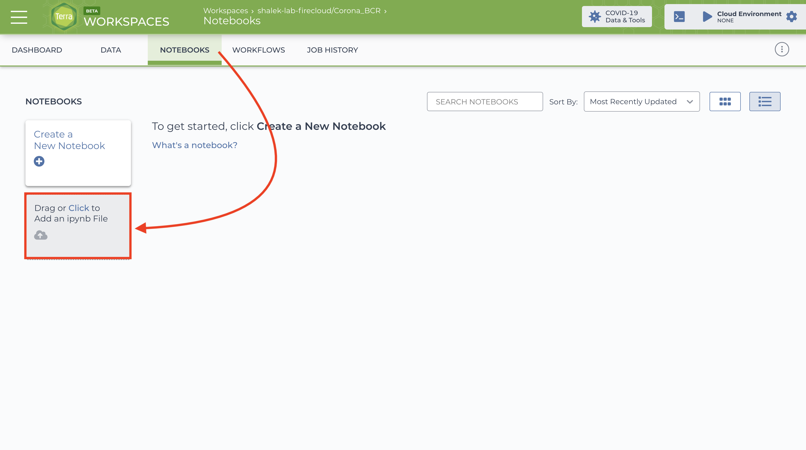

# Terra Notebooks

## Background

[Jupyter Notebooks](https://jupyter.org/) are an interactive medium for running code in compartmentalized chunks. While these notebooks are runnable locally, oftentimes with large datasets researchers must harness the power of cloud computing. As a result, many cloud analysis platforms such as [Terra](app.terra.bio) have engineered systems for running Jupyter Notebooks with a cloud backend. The Alexandria Project aims to provide several template notebooks which will aid researchers in analyzing and exploring their single-cell data. This guide will instruct you on how to run Alexandria notebooks on Terra.

## Visting your Terra workspace from your Alexandria study

[The Alexandria Portal](https://singlecell.broadinstitute.org/single_cell?scpbr=the-alexandria-project) is branded space of the Single Cell Portal, which is built upon Terra and Google Cloud Platform. When you have created a study on Alexandria, you can visit the Terra interface for your Alexandria study. The current way of doing so is to first visit the My Studies page, click "Show Details" for your study of choice, then click "View the Terra Workspace". Terra and SCP integration is an ongoing development thus this method is subject to change in the future.

## Uploading an Alexandria notebook and customizing your notebook runtime

You can download Alexandria notebooks from the [Alexandria GitHub repository](https://github.com/ShalekLab/alexandria/tree/master/notebooks). In the Notebooks tab of your Terra workspace, you will see the option to add an existing ipynb (iPython Notebook) file. Upload the notebook file of your choice.

Once that is done, you must create a Runtime Environment in which to run your notebook. At the top right, click the gear icon for "Update cloud environment". 

You should click the "Customize" button.

Under "Application Configuration", you should scroll down to select "Custom Environment".

The name of the container image will be referenced in the Notebook file. You should enter in that image address. Alexandria images can be found on [Docker Hub](https://hub.docker.com/orgs/shaleklab/repositories) as well. Configure the cloud compute profile based on recommendations from the notebook. In general, CPUs are expensive and not as impactful for these notebooks as RAM and diskspace are. While dependent on the size of your datasets, approximately 16GB RAM and 100GB disk space should work in most scenarios. You can always reconfigure your runtime if your parameters are too small (the consequences of doing so varies, e.g. changing diskspace will most likely delete your persistent disk and create a new one).

Once you click "Next" and "Create", your runtime may take a few minutes to be created and hosted. You can then click on your notebook of choice and enter the Edit Mode to begin your analysis or exploration! The instructions within the notebooks should help you complete the journey.
