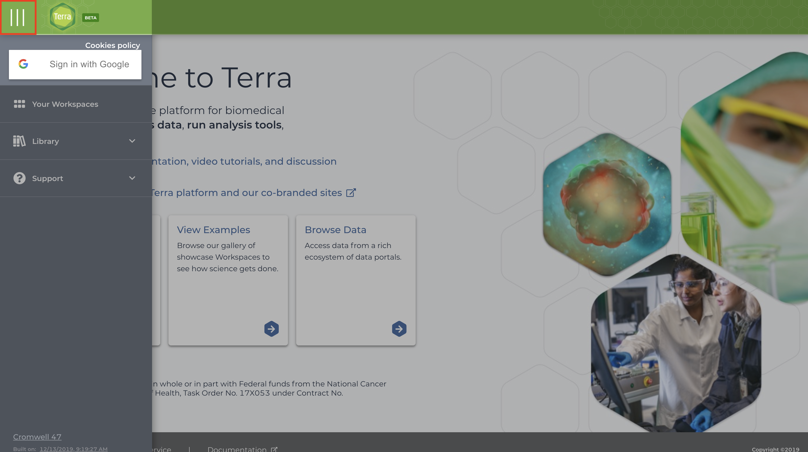
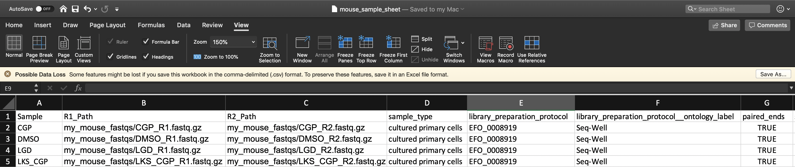
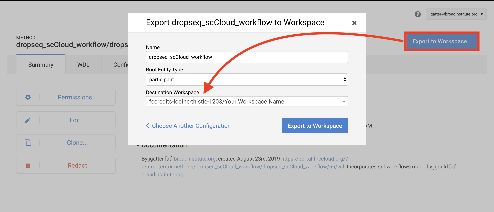

# Running dropseq_cumulus on Terra
  
The Terra version of the workflow has gives the user access to all workflow parameters as it is intended for users with advanced knowledge of the single-cell field.

If you prefer to run dropseq_cumulus on Alexandria for easy upload, see [here](https://alexandria-scrna-data-library.readthedocs.io/en/latest/alexandria/).
  
### KNOWN BUGS
None known at this time, please contact us with bug reports on our GitHub repo.

### 1. Sign In
Visit the [Terra by the Broad Institute]() and sign in using your preferred Google email account and complete the user profile registration steps if it is your first time using Terra. 

### 2. Create a New Workspace.

Skip this step if you have an existing workspace where you would like run dropseq_cumulus.
  
After logging in/registration you will be brought to the "Your Workspaces" page, where you will see the "Create a New Workspace button. Click it and fill out the fields to your liking. 
  
If you do not have a billing group, look [into creating a billing account](https://software.broadinstitute.org/firecloud/documentation/article?id=9762).
  
The authorization domain] is the group of users who will be able to access your workspace. You can create an authorization domain by following the instructions [here](https://support.terra.bio/hc/en-us/articles/360026775691).
  
### 3. Add Your Sequence Data
  
There are a few methods of uploading files to your workspace Google Bucket. Before proceeding, find your workspace bucket by visiting your workspace's "Dashboard" tab. In the bottom-right corner of the dashboard, you will see your Google Bucket ID which you can copy by clicking the adjacent clipboard button. You can visit the bucket interface by clicking the "Open in Browser" hyperlink.
 
First upload your sequence data files. We highly recommend installing and using `gsutil`, a fast and powerful tool made by Google that quickly moves files to and from the cloud. Through your computer's console, install the `gsutil` tool by following the [installation guide](https://cloud.google.com/storage/docs/gsutil_install). An example command that would transfer files from your computer to the workspace bucket would be:  
`gsutil -m cp local/path/to/file.fastq.gz gs://[Bucket ID]/destination/directory/`  
For an entire folder of sequence data, copy it recursively through using the command as such:  
`gsutil -m cp -r local/path/to/folder gs://[Bucket ID]/destination/directory`.  
Any desination path that does not exist already will be created upon entering the command!  
  
For alternative methods of data upload, click [here](https://alexandria-scrna-data-library.readthedocs.io/en/latest/dataupload/).

### 4. Add Your Input CSV File

Write your input csv file in a text editor or a spreadsheet manipulation program such as Microsoft Excel and save your file as a comma-separated value (.csv) file. The input CSV file must have column headers and contains the following in whatever order:

* **(REQUIRED)** the 'Sample' column, the sample/array names that prefix the respective .fastq(.gz) files/BCL directories and the count matrices outputted by Drop-seq pipeline.

* (OPTIONAL) both 'R1_Path' and 'R2_Path' columns, the paths to .fastq(.gz) files on the bucket. If these columns are not included or if some spreadsheet cells under these columns are left blank, the workflow will check `dropseq_default_directory` by default for unspecified files searching for the pattern `<Sample Name>*<R1 or R2>*.fastq.gz`. As an example, for `gs://bucketID/fastqs/samplename_R1.fastq` you could enter "gs://bucketID/fastqs/samplename_R1.fastq", "fastqs/samplename_R1.fastq", or leave it blank and enter "fastqs" for the `dropseq_default_directory`.

* (OPTIONAL) 'BCL_Path' column, the paths to the BCL directories on the bucket. If not included or if cells are left blank, will check dropseq_default_directory by default. Include this column only if `run_bcl2fastq=true`. R1_Path and R2_Path columns will be ignored if so.

* (OPTIONAL) Other metadata columns that will be appended to the alexandria_metadata.txt (tab-delimited) file generated after running Cumulus. Column labels MUST match EXACTLY the names of the ATTRIBUTE list in the [Alexandria Metadata Convention](https://alexandria-scrna-data-library.readthedocs.io/en/latest/metadata/#the-alexandria-metadata-convention). Labels outside of this convention will be supported in the future. 

To verify that the paths you listed in the file are correct, you can navigate to your bucket using the instructions listed [above](https://alexandria-scrna-data-library.readthedocs.io/en/latest/terra/#3-add-your-sequence-data-and-input-csv-file) and locate your sequence data files. Click on each file to view its URI (gsURL), which should resemble the format `gs://<bucket ID>/path/to/file.fastq.gz` in the case of `gzip`-compressed FASTQ files (regular FASTQ files are fine too). The locations you should enter in the path columns of your input CSV file should be all of the characters following the bucket ID and trailing slash, in this case `path/to/file.fastq.gz`. 
  
When finished, upload your input CSV file to the bucket.

### 5. Import the dropseq_cumulus Workflow

This section may be subject to change in the near future as Terra is still undergoing development and soon Firecloud Methods will be integrated to Terra rather than remain in the legacy application.

To import workflows for running jobs in your workspace, click the "Workflow" tab and click the "Find a Workflow" button. On the window that pops up, click the "Broad Method Repository" hyperlink to be brought to FireCloud Methods. .
  
In the search bar, enter "dropseq_cumulus", hit search, and click on the dropseq_cumulus hyperlink when it appears. .
  
Towards the top-right of the workflow page, click "Export to Workspace..." button and then click the "Use Blank Configuration" button. Select your workspace as the destination workspace via the bottom-most dropdown menu. Click the "Export to Workspace" button and when it offers you to visit the edit page, click "Yes". 

### 6. Configure and Launch dropseq_cumulus

You should be on the edit page of the tool now, but to access this page of the tool in the future, you can go to the Workflow tab of your Terra Workspace and click on the dropseq_cumulus button.
  
This page is where you set variables for dropseq_cumulus, Drop-seq pipeline workflow, and cumulus workflow. First click the bubble for "Process single workflow from files." Scroll down to fill out required inputs. Note that Strings must be surrounded by quotation marks and Booleans must be typed as `true` or `false` (case sensitive, don't surround with quotation marks). 
  
To set values for optional parameters, click the "Show optional inputs" text above the "Task name" column and scroll down. These are variables that have default values if the boxes are left empty, so there is no need to fill each out unless it suits your needs. To better understand the "dropseq" and "cumulus" inputs, read the [Drop-seq pipeline](https://cumulus-doc.readthedocs.io/en/latest/drop_seq.html#inputs) and [Cumulus](https://cumulus-doc.readthedocs.io/en/latest/cumulus.html#aggregate-matrix) documentations. It should be mentioned that each workflow's required inputs have been overridden by dropseq_cumulus workflow (e.g. input_csv_file, output_directory, etc.), so refer to the dropseq_cumulus documentation for those related variables.
  
When satisfied with your inputs, save them using the button in the upper-right and and then hit the "RUN ANALYSIS" button to the left. You will be brought to the job history page where your job has been logged. Here you will eventually know if the job ran succesfully. Provided the job does not fail within 10 minutes, the job will take about a variable amount of time to complete depending on the tasks you are running and the amount of data you gave it. Drop-seq pipeline usually will take 20 to 45 hours to run while cumulus should take an hour or less.

### 7. Advice for Troubleshooting

If the job fails it is recommended you navigate to and read the log file of the task that failed.  
To do this, click the failed job in "Job History" tab and click "View" on the next page. Then on the workflow status page under the "List View" tab, click the hyperlink of the failed task and repeat if there are failed subtasks. On the failed subtask that has no children, click on the log file button and skim to gain a better understanding. 
  
Evaluate the error based on the message and decide whether you need to alter variables, move files in your bucket, or change and reupload your input CSV file.

### 8. Uploading Cumulus Output Files to Alexandria for Visualization

The explicit workflow outputs of dropseq_cumulus are the alexandria metadata file (alexandria_metadata.txt), the dense expression matrix (ends with .scp.expr.txt), and the two coordinate files (end with .scp.X_diffmap_pca.coords.txt and .scp.X_fitsne.coords.txt). Download these to your computer by visiting your Google Bucket through the workspace dashboard and then reupload via the first four tabs of the Upload/Edit Study page of the Alexandria workspace (See [Running dropseq_cumulus on the Alexandria](https://alexandria-scrna-data-library.readthedocs.io/en/latest/alexandria/) for a better understanding). Alternatively, use `gsutil` to transfer the files from your Terra bucket to your Alexandria bucket

Synchronize your Single Cell Portal study to account for the added files. Visualize the study by clicking the "Explore" tab and then the "View Options" hyperlink to gain more options for analysis. 

